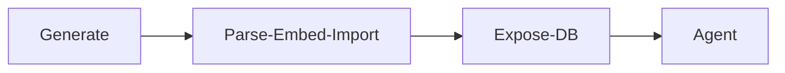

# Financial Information Agent - Demo

This repo holds the entire stack to run a financial focused agent from raw data to agent.  It is comprised of a few applications that contribute to this.

## Design

The stack design for this agent includes the following components.  It is designed to only require access to an LLM (currently supporting OpenAI).

- [Data Generator](./data-generator/) - This project is written in TypeScript and will generate sample 10K financial reports for ficitious companies.  The output is PDF documents.

- [Ingestion Service](./pdf-ingestion-service/) - This project is written in TypeScript and can parse PDFs, create embeddings, create a LanceDB and table, and import the data into the database.

- [Data Service](./data-service/) - This project is written in TypeScript and creates a REST API that services queries to the LancdDB.

- [Agent](./agent) - This project is written in C# and creates a Agent with Semantic Kernel (and the Agent Framework) and will accept prompts, use a plugin to call the data service as needed.

